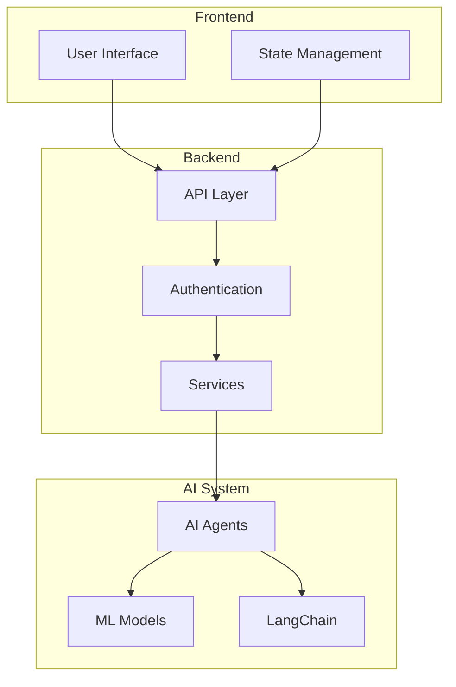

# AWS Orchestrator Documentation 📚

## Overview 🌟

Welcome to the AWS Orchestrator documentation! This comprehensive guide covers all aspects of our system, from setup to advanced features.

## Directory Structure 📂

```
docs/
├── frontend/           # Frontend documentation
│   ├── setup/         # Setup and installation
│   ├── components/    # UI components
│   └── workflows/     # User workflows
│
├── backend/           # Backend documentation
│   ├── api/          # API documentation
│   ├── setup/        # Installation guide
│   └── architecture/ # System design
│
└── ai/               # AI components
    ├── agents/       # Multi-agent system
    ├── models/       # ML models
    └── workflows/    # AI workflows
```

## Quick Links 🔗

### Getting Started 🚀
- [Frontend Setup](./frontend/setup/README.md)
- [Backend Setup](./backend/setup/README.md)
- [API Documentation](./backend/api/README.md)

### Architecture 🏗️
- [System Overview](./backend/architecture/README.md)
- [AI Components](./ai/README.md)
- [Frontend Design](./frontend/components/README.md)

### Development 💻
- [Contributing Guidelines](./CONTRIBUTING.md)
- [Code Standards](./CODE_STANDARDS.md)
- [Testing Guide](./TESTING.md)

## System Architecture 🔄



## Features 🎯

- 🤖 Multi-agent AI system
- 🔐 Secure AWS integration
- 📊 Real-time monitoring
- 🔄 Automated workflows
- 📱 Responsive UI
- 🚀 Scalable architecture

## Getting Started 🏁

1. **Clone the Repository**
   ```bash
   git clone (https://github.com/anshumansp/Trending-Stocks-Predictor/)
   cd aws-orchestrator
   ```

2. **Setup Development Environment**
   - Follow [Frontend Setup](./frontend/setup/README.md)
   - Follow [Backend Setup](./backend/setup/README.md)

3. **Run Tests**
   ```bash
   # Frontend tests
   cd frontend && npm test
   
   # Backend tests
   cd backend && pytest
   ```

## Contributing 🤝

Please read our [Contributing Guidelines](./CONTRIBUTING.md) before submitting changes.

## Support 💬

- 📧 Email: support@example.com
- 💬 Discord: [Join our server]
- 📝 Issues: GitHub Issues

## License 📄

This project is licensed under the MIT License - see the [LICENSE](./LICENSE) file for details.
