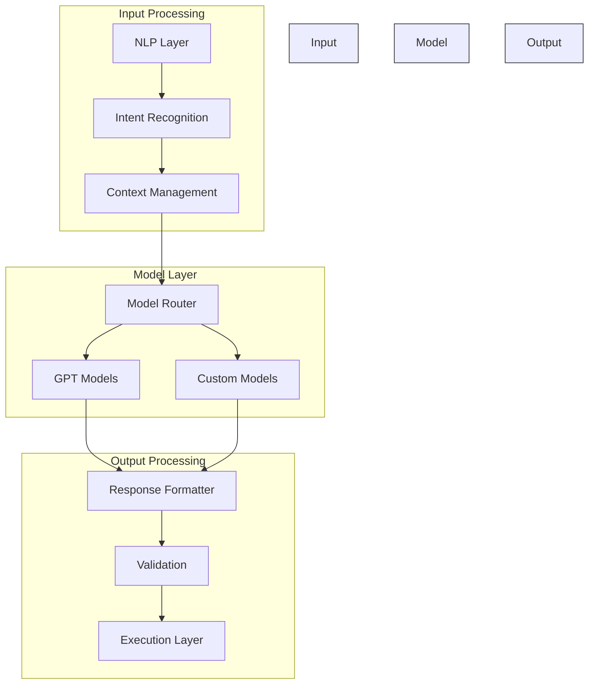

# Chat Models Documentation 🤖

## Overview 🌐

Our AWS Orchestrator uses advanced chat models to enable natural language interactions for AWS resource management and automation.

## Supported Models 🎯

### 1. GPT Models
- GPT-4
- GPT-3.5-turbo
- Fine-tuned variants

### 2. Custom Models
- Domain-specific models
- Task-specific models
- Hybrid models

## Model Integration 🔌



## Implementation Examples 💻

### 1. Model Configuration
```python
class ModelConfig:
    def __init__(self, model_name: str, parameters: Dict[str, Any]):
        self.model_name = model_name
        self.parameters = {
            "temperature": 0.7,
            "max_tokens": 1000,
            "top_p": 0.95,
            **parameters
        }
```

### 2. Chat Handler
```python
class ChatHandler:
    def __init__(self, model: str, config: ModelConfig):
        self.model = model
        self.config = config
        self.context = ConversationContext()
    
    async def process_message(self, message: str) -> str:
        context = self.context.get_context()
        response = await self.model.generate(
            prompt=message,
            context=context,
            **self.config.parameters
        )
        return self.format_response(response)
```

## Prompt Engineering 📝

### 1. System Prompts
```python
SYSTEM_PROMPTS = {
    "aws_management": """
    You are an AWS resource management assistant.
    Help users with:
    1. Resource provisioning
    2. Cost optimization
    3. Security configuration
    4. Performance monitoring
    
    Provide clear, actionable responses.
    """,
    
    "security_audit": """
    You are a security auditing assistant.
    Focus on:
    1. Security best practices
    2. Compliance requirements
    3. Vulnerability assessment
    4. Risk mitigation
    
    Always prioritize security.
    """
}
```

### 2. Dynamic Prompts
```python
def generate_prompt(task_type: str, parameters: Dict[str, Any]) -> str:
    template = PROMPT_TEMPLATES[task_type]
    return template.format(**parameters)
```

## Context Management 🧠

### 1. Conversation Context
```python
class ConversationContext:
    def __init__(self, max_history: int = 10):
        self.history = deque(maxlen=max_history)
        self.metadata = {}
    
    def add_message(self, role: str, content: str):
        self.history.append({
            "role": role,
            "content": content,
            "timestamp": time.time()
        })
    
    def get_context(self) -> List[Dict[str, Any]]:
        return list(self.history)
```

### 2. State Management
```python
class ChatState:
    def __init__(self):
        self.current_task = None
        self.parameters = {}
        self.last_response = None
    
    def update_state(self, **kwargs):
        for key, value in kwargs.items():
            setattr(self, key, value)
```

## Response Processing 🔄

### 1. Response Validation
```python
class ResponseValidator:
    def validate(self, response: str) -> bool:
        """Validate model response"""
        if not response:
            return False
        
        try:
            parsed = self.parse_response(response)
            return self.check_constraints(parsed)
        except Exception as e:
            logger.error(f"Validation failed: {str(e)}")
            return False
```

### 2. Response Formatting
```python
class ResponseFormatter:
    def format(self, response: str) -> Dict[str, Any]:
        """Format model response"""
        return {
            "content": self.clean_response(response),
            "metadata": self.extract_metadata(response),
            "actions": self.extract_actions(response)
        }
```

## Error Handling ⚠️

### 1. Model Errors
```python
class ModelErrorHandler:
    def handle_error(self, error: Exception) -> str:
        if isinstance(error, TokenLimitError):
            return self.handle_token_limit()
        elif isinstance(error, ModelTimeoutError):
            return self.handle_timeout()
        else:
            return self.handle_generic_error(error)
```

### 2. Fallback Strategies
```python
class FallbackStrategy:
    def __init__(self):
        self.fallback_models = [
            "gpt-3.5-turbo",
            "custom-model-v1",
            "rule-based-system"
        ]
    
    async def fallback(self, original_error: Exception) -> str:
        for model in self.fallback_models:
            try:
                return await self.try_model(model)
            except Exception:
                continue
        return self.get_safe_response()
```

## Performance Optimization ⚡

### 1. Caching
```python
class ResponseCache:
    def __init__(self):
        self.cache = TTLCache(maxsize=1000, ttl=3600)
    
    def get_cached_response(self, key: str) -> Optional[str]:
        return self.cache.get(key)
    
    def cache_response(self, key: str, response: str):
        self.cache[key] = response
```

### 2. Batch Processing
```python
class BatchProcessor:
    async def process_batch(self, messages: List[str]) -> List[str]:
        tasks = [
            self.process_message(msg)
            for msg in messages
        ]
        return await asyncio.gather(*tasks)
```

## Best Practices 📚

1. **Model Usage**
   - Proper temperature settings
   - Context length management
   - Token optimization
   - Response validation

2. **Error Handling**
   - Graceful degradation
   - Fallback strategies
   - User feedback
   - Error logging

3. **Performance**
   - Response caching
   - Batch processing
   - Async operations
   - Resource management

4. **Security**
   - Input sanitization
   - Output validation
   - Data privacy
   - Access control
