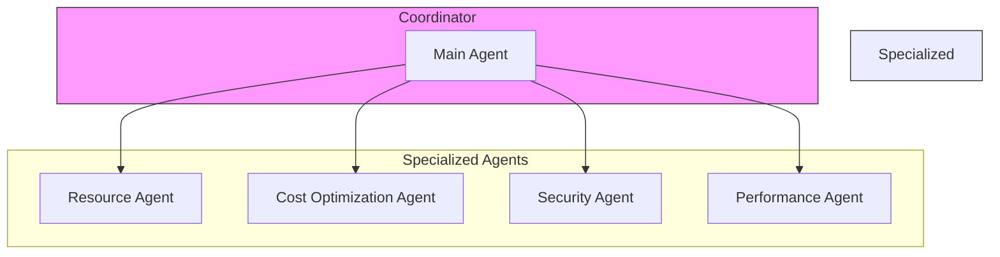
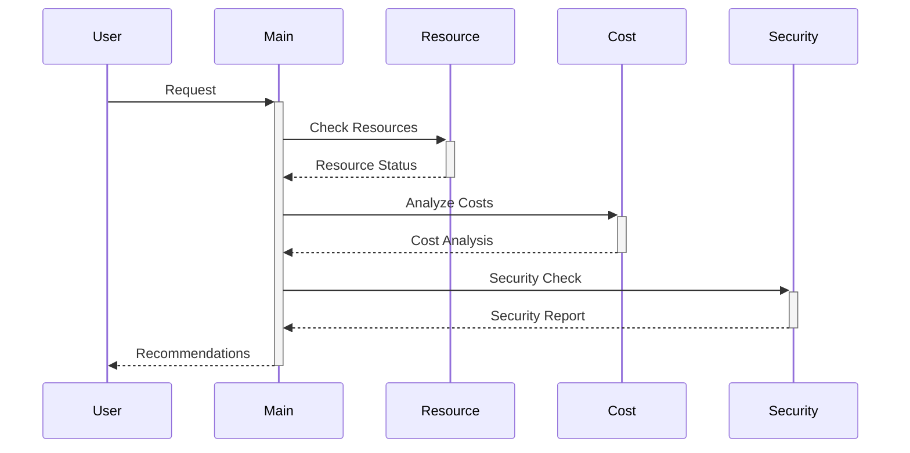
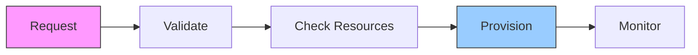
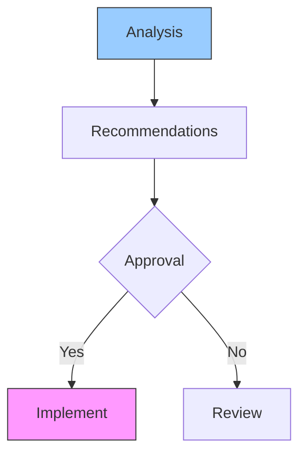

# AI Agents System 🤖

## Overview 🌐

Our multi-agent system orchestrates AWS resources through specialized AI agents that work together to manage, optimize, and automate cloud operations.

## Agent Types 🎯



## Agent Responsibilities 📋

### 1. Resource Agent
- Resource provisioning
- Configuration management
- Resource lifecycle
- State monitoring

### 2. Cost Optimization Agent
- Cost analysis
- Usage optimization
- Budget monitoring
- Savings recommendations

### 3. Security Agent
- Security assessment
- Compliance checking
- Vulnerability scanning
- Access management

### 4. Performance Agent
- Performance monitoring
- Bottleneck detection
- Scaling recommendations
- Resource optimization

## Agent Communication 🔄



## Implementation Details 💻

### 1. Agent Base Class
```python
class BaseAgent:
    def __init__(self, name: str, capabilities: List[str]):
        self.name = name
        self.capabilities = capabilities
        self.memory = AgentMemory()
    
    async def process(self, task: Task) -> Result:
        """Process a task within agent's capabilities"""
        if not self.can_handle(task):
            return self.delegate(task)
        return await self.execute(task)
```

### 2. Agent Communication
```python
class AgentCommunication:
    def __init__(self):
        self.message_queue = asyncio.Queue()
        self.handlers = {}
    
    async def send_message(self, to: str, message: Message):
        await self.message_queue.put((to, message))
    
    async def process_messages(self):
        while True:
            to, message = await self.message_queue.get()
            await self.handlers[to].handle(message)
```

## Agent Workflows 🔄

### 1. Resource Provisioning


### 2. Optimization Workflow


## Memory Management 🧠

### 1. Short-term Memory
```python
class ShortTermMemory:
    def __init__(self, capacity: int = 100):
        self.capacity = capacity
        self.memory = deque(maxlen=capacity)
    
    def add(self, item: Any):
        self.memory.append(item)
    
    def get_recent(self, n: int) -> List[Any]:
        return list(itertools.islice(self.memory, n))
```

### 2. Long-term Memory
```python
class LongTermMemory:
    def __init__(self):
        self.db = Database()
    
    async def store(self, key: str, value: Any):
        await self.db.insert(key, value)
    
    async def retrieve(self, key: str) -> Any:
        return await self.db.get(key)
```

## Error Handling ⚠️

### 1. Agent Recovery
```python
class AgentRecovery:
    def __init__(self, agent: BaseAgent):
        self.agent = agent
        self.backup = BackupSystem()
    
    async def recover(self, error: Exception):
        state = await self.backup.get_last_state()
        await self.agent.restore(state)
        return await self.agent.retry()
```

### 2. Task Retry
```python
@retry(max_attempts=3, backoff=exponential_backoff)
async def execute_task(task: Task) -> Result:
    try:
        return await agent.process(task)
    except Exception as e:
        logger.error(f"Task failed: {str(e)}")
        raise
```

## Monitoring & Metrics 📊

### 1. Agent Metrics
```python
class AgentMetrics:
    def __init__(self):
        self.metrics = {}
    
    def track(self, metric: str, value: float):
        if metric not in self.metrics:
            self.metrics[metric] = []
        self.metrics[metric].append((time.time(), value))
    
    def get_metrics(self, metric: str) -> List[Tuple[float, float]]:
        return self.metrics.get(metric, [])
```

### 2. Performance Monitoring
```python
class PerformanceMonitor:
    def __init__(self):
        self.tracker = MetricsTracker()
    
    async def monitor(self):
        while True:
            metrics = await self.collect_metrics()
            await self.analyze_metrics(metrics)
            await asyncio.sleep(60)
```

## Best Practices 📝

1. **Agent Design**
   - Single responsibility
   - Clear communication
   - Proper error handling
   - State management

2. **Performance**
   - Efficient algorithms
   - Resource pooling
   - Caching strategies
   - Async operations

3. **Security**
   - Access control
   - Data encryption
   - Audit logging
   - Secure communication

4. **Maintenance**
   - Regular updates
   - Performance tuning
   - Security patches
   - Documentation
