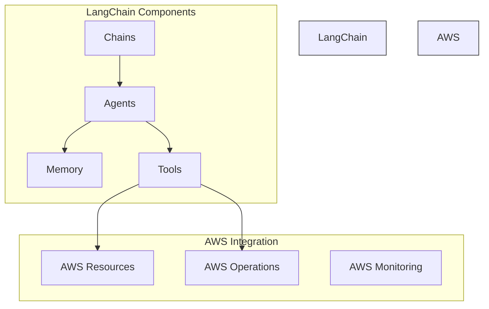
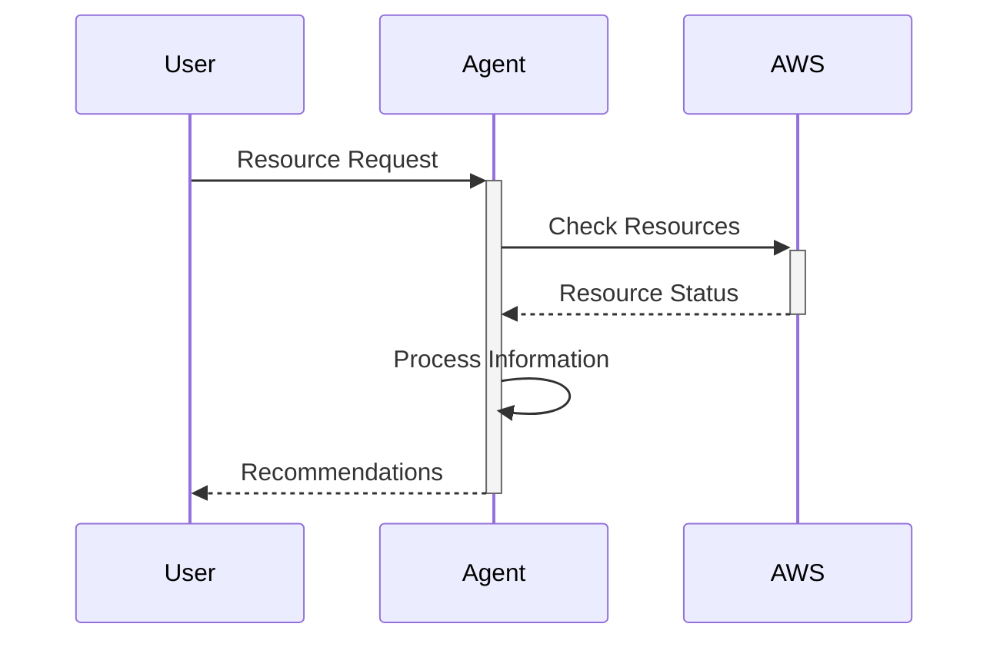

# LangChain Integration 🔗

## Overview 🌐

LangChain is integrated into our AWS Orchestrator to provide advanced language model capabilities for AWS resource management and automation.

## Architecture 🏗️



## Components 🧩

### 1. Chains
```python
from langchain.chains import LLMChain
from langchain.prompts import PromptTemplate

prompt = PromptTemplate(
    input_variables=["resource_type"],
    template="Analyze the {resource_type} usage patterns and suggest optimizations."
)

chain = LLMChain(
    llm=llm,
    prompt=prompt
)
```

### 2. Agents
```python
from langchain.agents import initialize_agent, Tool
from langchain.agents import AgentType

tools = [
    Tool(
        name="AWS Resource Analyzer",
        func=analyze_resources,
        description="Analyze AWS resource usage and costs"
    )
]

agent = initialize_agent(
    tools, 
    llm, 
    agent=AgentType.ZERO_SHOT_REACT_DESCRIPTION,
    verbose=True
)
```

### 3. Memory
```python
from langchain.memory import ConversationBufferMemory

memory = ConversationBufferMemory(
    memory_key="chat_history",
    return_messages=True
)
```

## AWS Integration 🔧

### 1. Resource Management


### 2. Cost Optimization
```python
def analyze_costs(resource_id: str):
    """
    Analyze resource costs and provide optimization recommendations
    """
    current_costs = get_resource_costs(resource_id)
    recommendations = agent.run(f"Analyze costs for {resource_id}")
    return {
        "current_costs": current_costs,
        "recommendations": recommendations
    }
```

## Prompt Engineering 📝

### 1. Resource Analysis Template
```python
RESOURCE_ANALYSIS_TEMPLATE = """
Analyze the following AWS resource:
Resource Type: {resource_type}
Resource ID: {resource_id}
Current Usage: {usage_data}

Provide recommendations for:
1. Cost optimization
2. Performance improvement
3. Security enhancement

Context: {additional_context}
"""
```

### 2. Action Generation Template
```python
ACTION_TEMPLATE = """
Based on the analysis, generate AWS CLI commands to implement the following changes:
Desired Changes: {changes}
Resource ID: {resource_id}
Region: {region}

Consider:
1. Safety checks
2. Rollback procedures
3. Impact assessment
"""
```

## Memory Management 🧠

### 1. Conversation History
```python
from langchain.memory import ConversationBufferWindowMemory

memory = ConversationBufferWindowMemory(
    k=5,  # Keep last 5 interactions
    memory_key="chat_history",
    return_messages=True
)
```

### 2. State Management
```python
class ResourceStateMemory:
    def __init__(self):
        self.states = {}
    
    def update_state(self, resource_id, state):
        self.states[resource_id] = state
    
    def get_state(self, resource_id):
        return self.states.get(resource_id)
```

## Error Handling ⚠️

### 1. Retry Logic
```python
from tenacity import retry, stop_after_attempt, wait_exponential

@retry(stop=stop_after_attempt(3), wait=wait_exponential())
def execute_aws_operation(operation):
    try:
        return agent.run(operation)
    except Exception as e:
        logger.error(f"Operation failed: {str(e)}")
        raise
```

### 2. Fallback Mechanisms
```python
def safe_execute(operation):
    try:
        return agent.run(operation)
    except Exception:
        return fallback_handler.handle(operation)
```

## Best Practices 📚

1. **Prompt Design**
   - Clear instructions
   - Consistent formatting
   - Proper context

2. **Memory Management**
   - Regular cleanup
   - Context limitation
   - State persistence

3. **Error Handling**
   - Graceful degradation
   - Detailed logging
   - User feedback

4. **Performance**
   - Caching responses
   - Batch processing
   - Async operations

## Testing 🧪

### 1. Unit Tests
```python
def test_resource_analysis():
    result = agent.analyze_resource("i-1234567890")
    assert "recommendations" in result
    assert len(result["recommendations"]) > 0
```

### 2. Integration Tests
```python
def test_end_to_end():
    # Setup test resources
    resource_id = create_test_resource()
    
    # Run analysis
    analysis = agent.analyze_resource(resource_id)
    
    # Implement recommendations
    changes = agent.implement_changes(analysis["recommendations"])
    
    # Verify changes
    assert verify_changes(resource_id, changes)
```

## Monitoring 📊

### 1. Performance Metrics
```python
def track_metrics(func):
    def wrapper(*args, **kwargs):
        start_time = time.time()
        result = func(*args, **kwargs)
        duration = time.time() - start_time
        
        metrics.push({
            "function": func.__name__,
            "duration": duration,
            "success": result is not None
        })
        
        return result
    return wrapper
```

### 2. Usage Analytics
```python
class UsageTracker:
    def track_operation(self, operation_type, details):
        analytics.track({
            "operation": operation_type,
            "timestamp": datetime.now(),
            "details": details
        })
