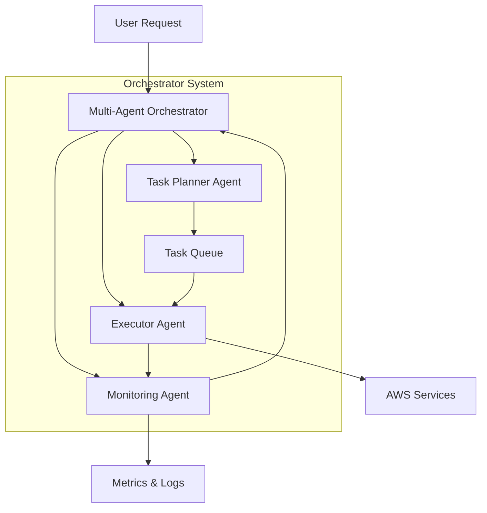
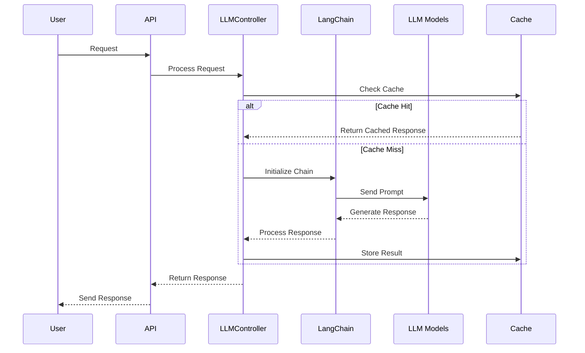
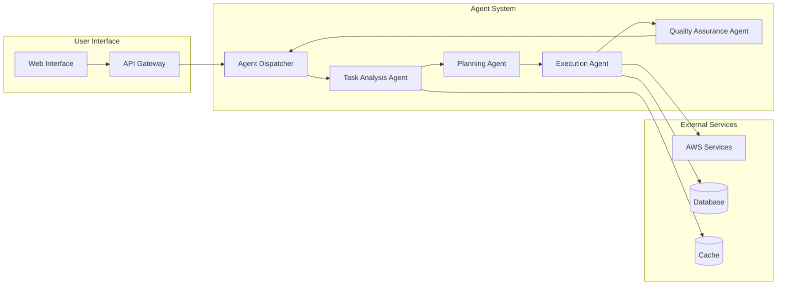
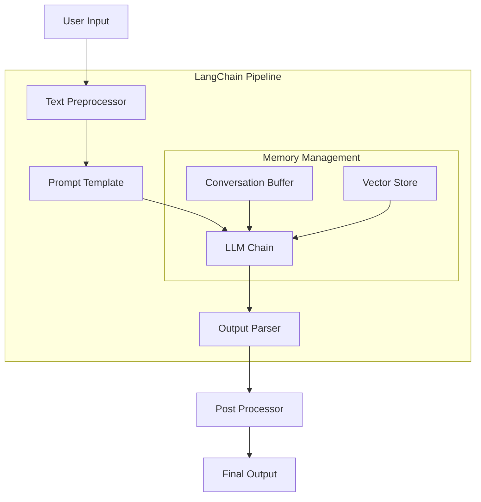
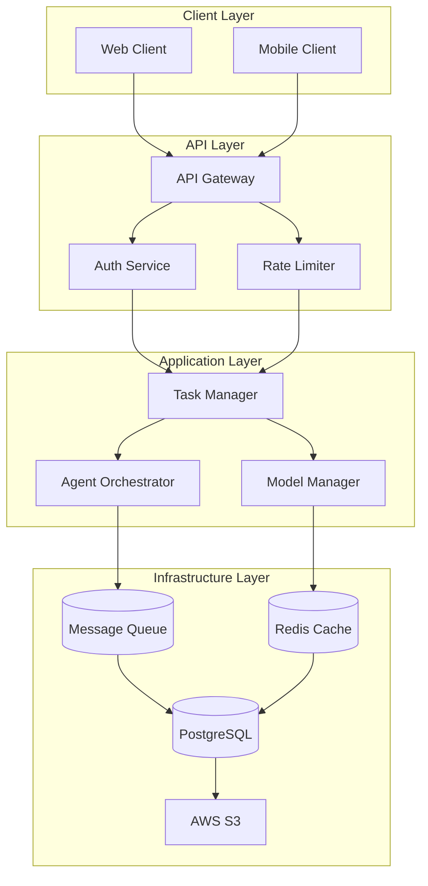
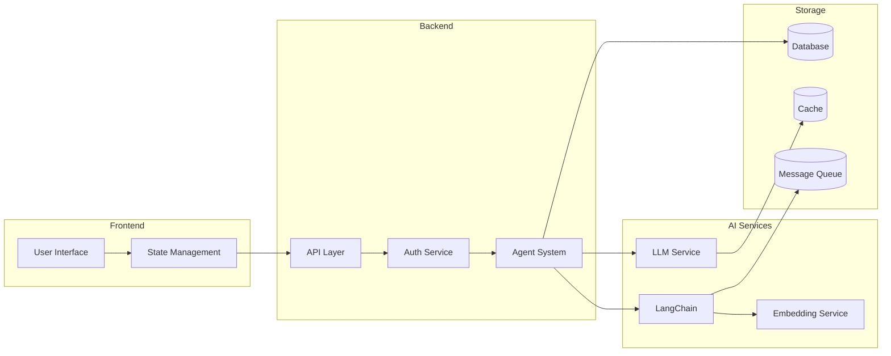
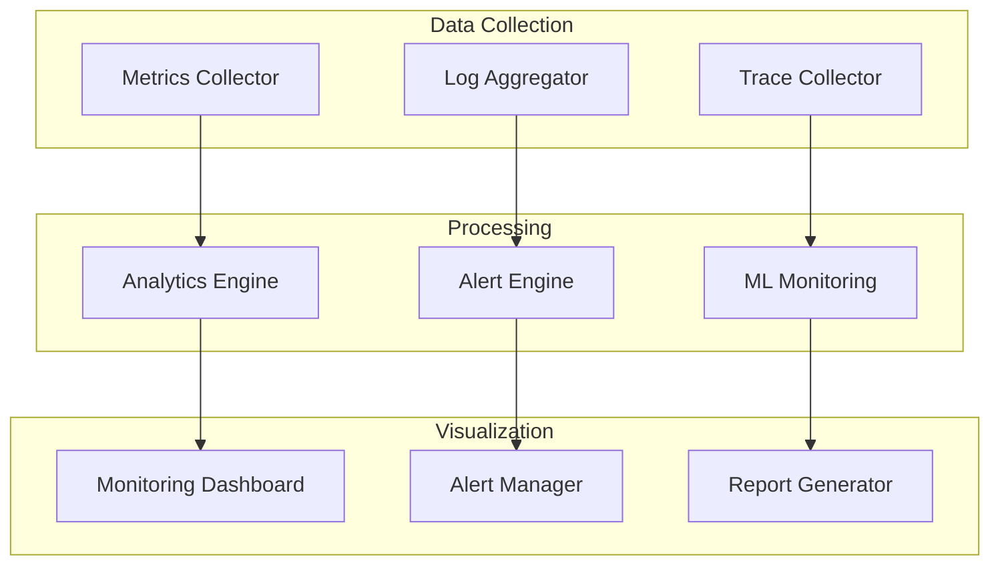

# AI System Architecture and Workflow

## Multi-Agent Orchestrator System

## LLM Integration Architecture

## Agentic System Workflow

## LangChain Pipeline

## Backend Application Architecture

## System Integration Points

## Monitoring and Observability

These diagrams provide a visual representation of:
1. Multi-agent orchestration system and its components
2. LLM integration and request flow
3. Agentic system workflow and interaction
4. LangChain pipeline and components
5. Backend application architecture
6. System integration points
7. Monitoring and observability setup

Each diagram is created using Mermaid markdown syntax, which renders as clear, interactive diagrams when viewed in compatible markdown viewers or documentation systems.
