# System Architecture 🏗️

## Overview 🌐

The AWS Orchestrator is built on a microservices architecture, leveraging AWS services and AI capabilities for efficient resource management.

## System Components 🔧

```mermaid
graph TB
    subgraph Frontend
        UI[User Interface]
        State[State Management]
    end
    
    subgraph API Gateway
        Auth[Authentication]
        Routes[API Routes]
        WS[WebSocket]
    end
    
    subgraph Services
        TaskService[Task Service]
        ResourceService[Resource Service]
        AIService[AI Service]
    end
    
    subgraph AI System
        Agents[AI Agents]
        Models[ML Models]
        LangChain[LangChain]
    end
    
    subgraph AWS Services
        EC2[EC2]
        S3[S3]
        Lambda[Lambda]
        CloudWatch[CloudWatch]
    end
    
    UI --> Auth
    State --> WS
    Auth --> Routes
    Routes --> TaskService
    Routes --> ResourceService
    Routes --> AIService
    
    TaskService --> Agents
    ResourceService --> AWS Services
    AIService --> Models
    AIService --> LangChain
    
    style Frontend fill:#f9f,stroke:#333
    style API Gateway fill:#ff9,stroke:#333
    style Services fill:#9f9,stroke:#333
    style AI System fill:#99f,stroke:#333
    style AWS Services fill:#f99,stroke:#333
```

## Component Details 📋

### 1. Frontend Layer
- React-based SPA
- Redux state management
- WebSocket real-time updates

### 2. API Gateway
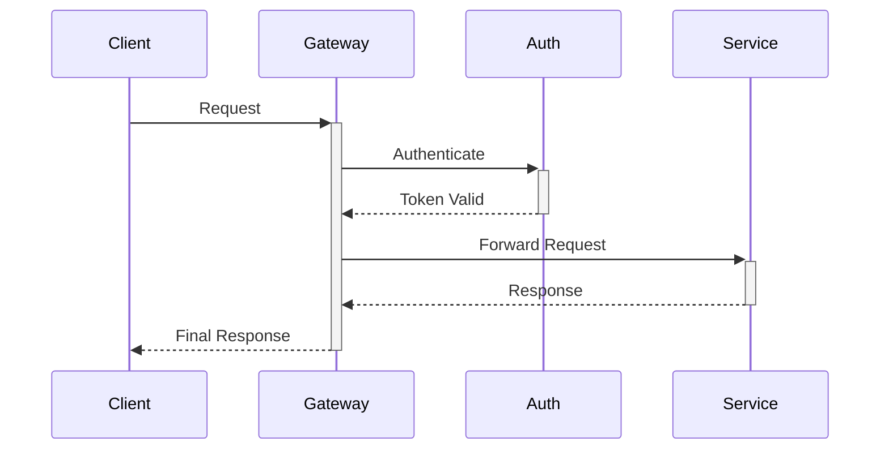

### 3. Service Layer

#### Task Service
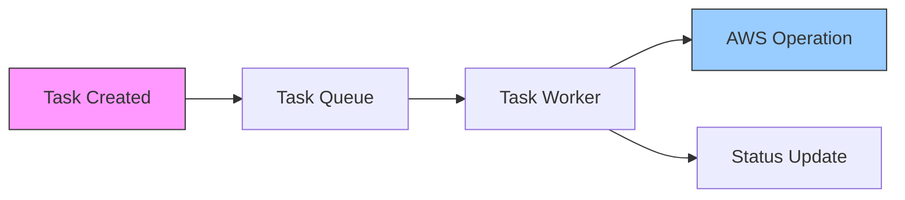

#### Resource Service
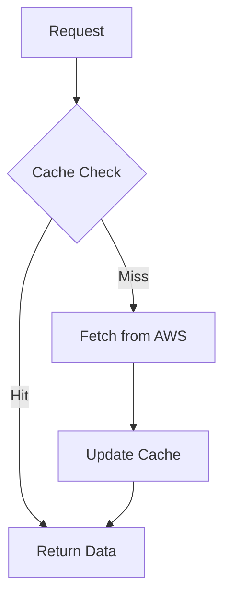

#### AI Service
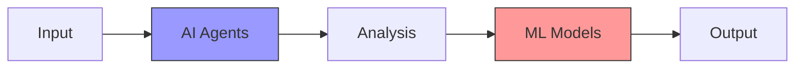

## Data Flow 🔄

### Task Processing Flow
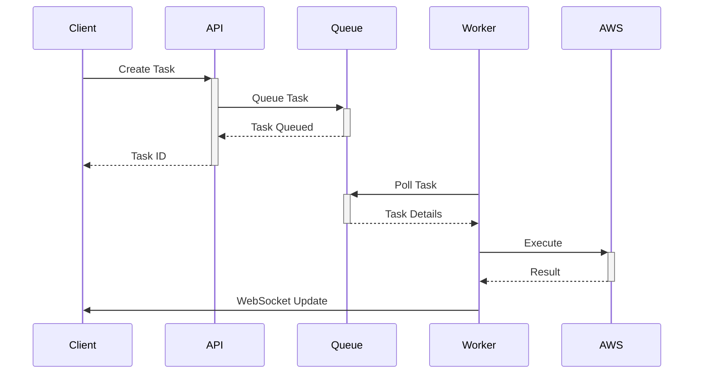

## Security Architecture 🔐

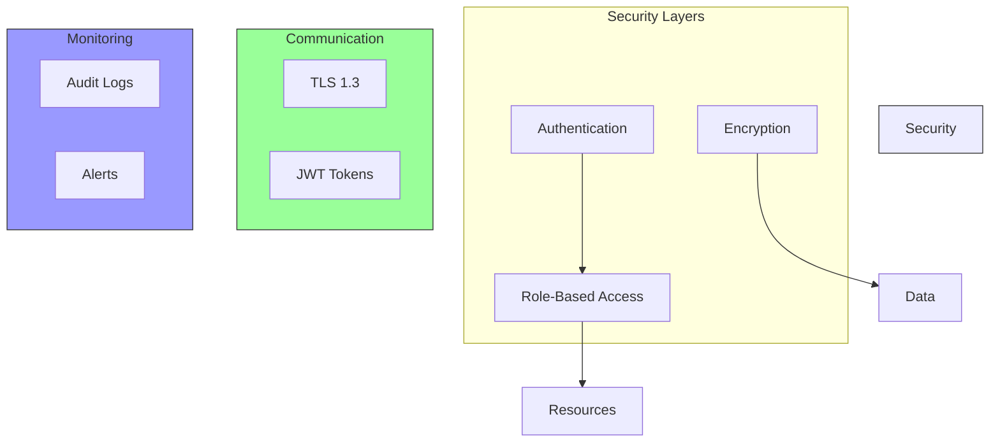

## Deployment Architecture 🚀

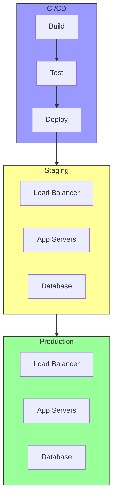

## Monitoring & Logging 📊

### Metrics Collection
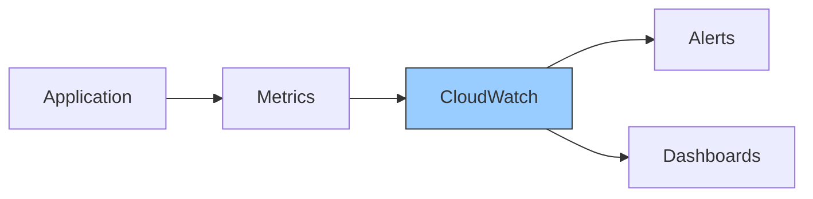

### Log Aggregation
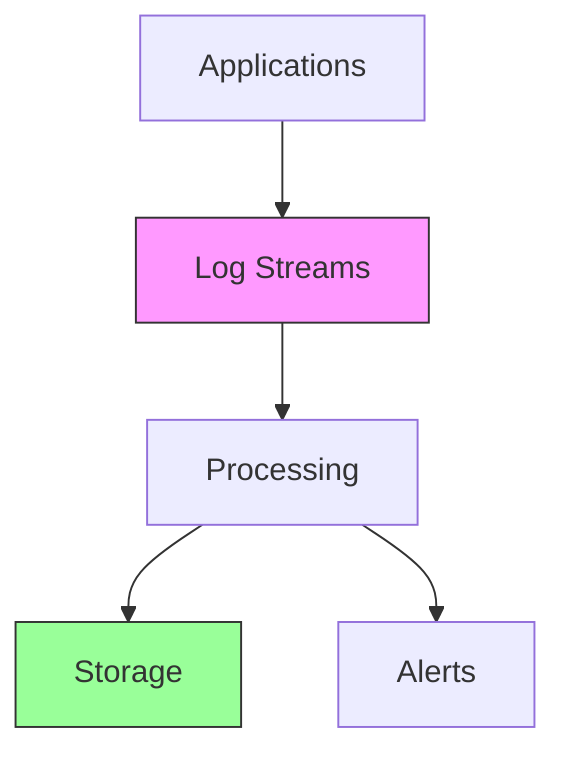

## Scaling Strategy 📈

### Horizontal Scaling
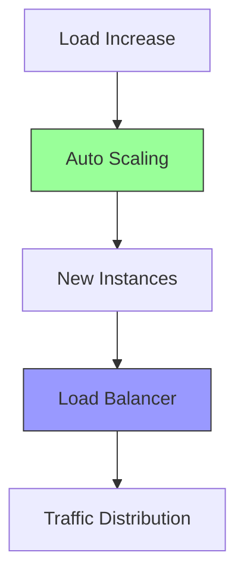

## Disaster Recovery 🔄

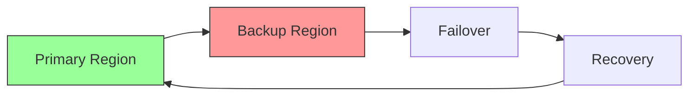

## Performance Optimization ⚡

### Caching Strategy
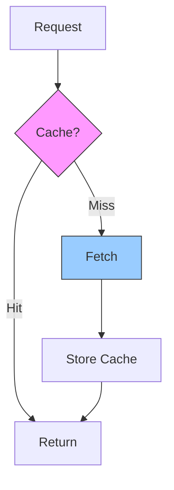

## Best Practices 📝

1. **Security**
   - Regular security audits
   - Encryption at rest and in transit
   - Principle of least privilege

2. **Scalability**
   - Stateless services
   - Database sharding
   - Caching strategies

3. **Reliability**
   - Circuit breakers
   - Retry mechanisms
   - Fallback strategies

4. **Monitoring**
   - Real-time alerts
   - Performance metrics
   - Error tracking
