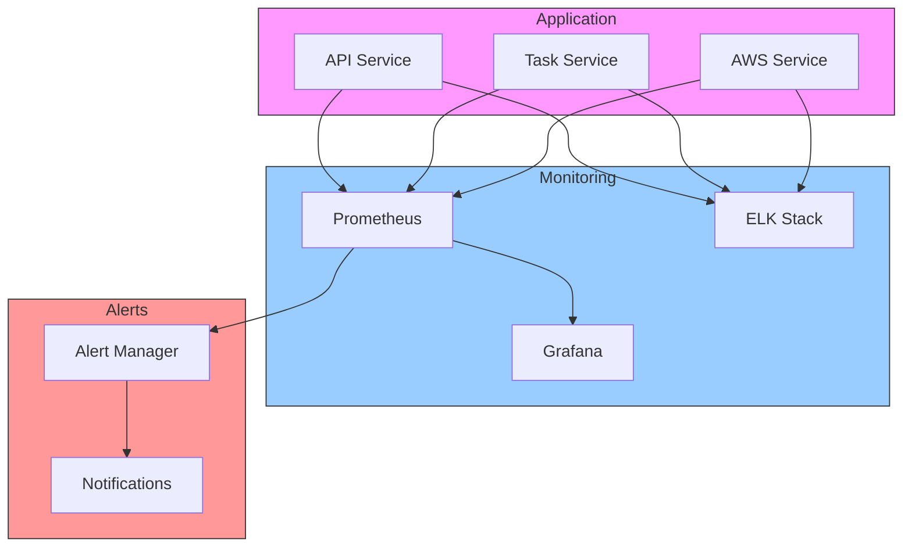

# Backend Monitoring Guide 📊

## Overview 🌐

This guide covers monitoring and observability strategies for the AWS Orchestrator backend.

## Monitoring Architecture 🏗️



## Metrics Collection 📈

### 1. Application Metrics
```python
from prometheus_client import Counter, Histogram, Gauge

# Request metrics
request_count = Counter(
    'http_requests_total',
    'Total HTTP requests',
    ['method', 'endpoint', 'status']
)

# Response time
response_time = Histogram(
    'http_response_time_seconds',
    'HTTP response time',
    ['endpoint']
)

# Active tasks
active_tasks = Gauge(
    'active_tasks',
    'Number of active tasks',
    ['task_type']
)
```

### 2. Resource Metrics
```python
# AWS resource metrics
resource_count = Gauge(
    'aws_resources_total',
    'Total AWS resources',
    ['resource_type', 'region']
)

resource_operations = Counter(
    'aws_operations_total',
    'AWS operations count',
    ['operation', 'resource_type', 'status']
)
```

## Logging System 📝

### 1. Log Configuration
```python
# config/logging.py
LOGGING_CONFIG = {
    "version": 1,
    "formatters": {
        "json": {
            "class": "pythonjsonlogger.jsonlogger.JsonFormatter",
            "format": "%(timestamp)s %(level)s %(name)s %(message)s"
        }
    },
    "handlers": {
        "console": {
            "class": "logging.StreamHandler",
            "formatter": "json"
        },
        "file": {
            "class": "logging.handlers.RotatingFileHandler",
            "filename": "app.log",
            "maxBytes": 10485760,
            "backupCount": 5,
            "formatter": "json"
        }
    }
}
```

### 2. Structured Logging
```python
import structlog

logger = structlog.get_logger()

def process_task(task_id: str):
    logger.info("processing_task",
        task_id=task_id,
        timestamp=datetime.utcnow().isoformat(),
        service="task_processor"
    )
```

## Alert Configuration ⚠️

### 1. Prometheus Alert Rules
```yaml
# alerts.yml
groups:
  - name: aws-orchestrator
    rules:
      - alert: HighErrorRate
        expr: rate(http_requests_total{status=~"5.."}[5m]) > 0.1
        for: 5m
        labels:
          severity: critical
        annotations:
          summary: High error rate detected
          
      - alert: TaskStuck
        expr: active_tasks > 100
        for: 15m
        labels:
          severity: warning
        annotations:
          summary: Large number of active tasks
```

### 2. Alert Manager
```yaml
# alertmanager.yml
route:
  group_by: ['alertname']
  group_wait: 30s
  group_interval: 5m
  repeat_interval: 1h
  receiver: 'team-email'

receivers:
  - name: 'team-email'
    email_configs:
      - to: 'team@example.com'
        from: 'alertmanager@example.com'
        smarthost: 'smtp.example.com:587'
```

## Dashboard Configuration 📊

### 1. Grafana Dashboard
```json
{
  "dashboard": {
    "title": "AWS Orchestrator Overview",
    "panels": [
      {
        "title": "Request Rate",
        "type": "graph",
        "targets": [
          {
            "expr": "rate(http_requests_total[5m])",
            "legendFormat": "{{method}} {{endpoint}}"
          }
        ]
      },
      {
        "title": "Response Times",
        "type": "heatmap",
        "targets": [
          {
            "expr": "rate(http_response_time_seconds_bucket[5m])",
            "legendFormat": "{{le}}"
          }
        ]
      }
    ]
  }
}
```

### 2. Resource Dashboard
```json
{
  "dashboard": {
    "title": "AWS Resources",
    "panels": [
      {
        "title": "Resource Count by Type",
        "type": "gauge",
        "targets": [
          {
            "expr": "aws_resources_total",
            "legendFormat": "{{resource_type}}"
          }
        ]
      }
    ]
  }
}
```

## Tracing System 🔍

### 1. OpenTelemetry Configuration
```python
from opentelemetry import trace
from opentelemetry.exporter.jaeger.thrift import JaegerExporter
from opentelemetry.sdk.trace import TracerProvider
from opentelemetry.sdk.trace.export import BatchSpanProcessor

def setup_tracing():
    trace.set_tracer_provider(TracerProvider())
    jaeger_exporter = JaegerExporter(
        agent_host_name="localhost",
        agent_port=6831,
    )
    trace.get_tracer_provider().add_span_processor(
        BatchSpanProcessor(jaeger_exporter)
    )
```

### 2. Trace Implementation
```python
from opentelemetry import trace

tracer = trace.get_tracer(__name__)

async def process_request(request_id: str):
    with tracer.start_as_current_span("process_request") as span:
        span.set_attribute("request_id", request_id)
        
        with tracer.start_span("validate_request") as validate_span:
            validate_request()
            
        with tracer.start_span("process_data") as process_span:
            process_data()
```

## Health Checks 💓

### 1. Health Check Endpoints
```python
@app.route("/health")
async def health_check():
    return {
        "status": "healthy",
        "timestamp": datetime.utcnow().isoformat(),
        "version": app.version,
        "checks": {
            "database": await check_database(),
            "aws": await check_aws_connection(),
            "cache": await check_cache()
        }
    }
```

### 2. Component Checks
```python
async def check_database():
    try:
        await db.execute("SELECT 1")
        return {"status": "up", "latency_ms": response_time}
    except Exception as e:
        return {"status": "down", "error": str(e)}
```

## Performance Monitoring ⚡

### 1. Resource Usage
```python
import psutil

def collect_system_metrics():
    return {
        "cpu_percent": psutil.cpu_percent(),
        "memory_percent": psutil.virtual_memory().percent,
        "disk_usage": psutil.disk_usage('/').percent,
        "network_io": psutil.net_io_counters()
    }
```

### 2. Application Performance
```python
from functools import wraps
import time

def measure_performance(func):
    @wraps(func)
    async def wrapper(*args, **kwargs):
        start_time = time.time()
        result = await func(*args, **kwargs)
        duration = time.time() - start_time
        
        response_time.observe(duration)
        return result
    return wrapper
```

## Best Practices 📚

1. **Metrics Collection**
   - Use meaningful metrics
   - Proper labeling
   - Regular collection
   - Data retention

2. **Alerting**
   - Clear alert rules
   - Proper thresholds
   - Alert routing
   - Alert fatigue prevention

3. **Logging**
   - Structured logging
   - Log levels
   - Log rotation
   - Log aggregation

4. **Performance**
   - Resource monitoring
   - Bottleneck detection
   - Optimization
   - Capacity planning
