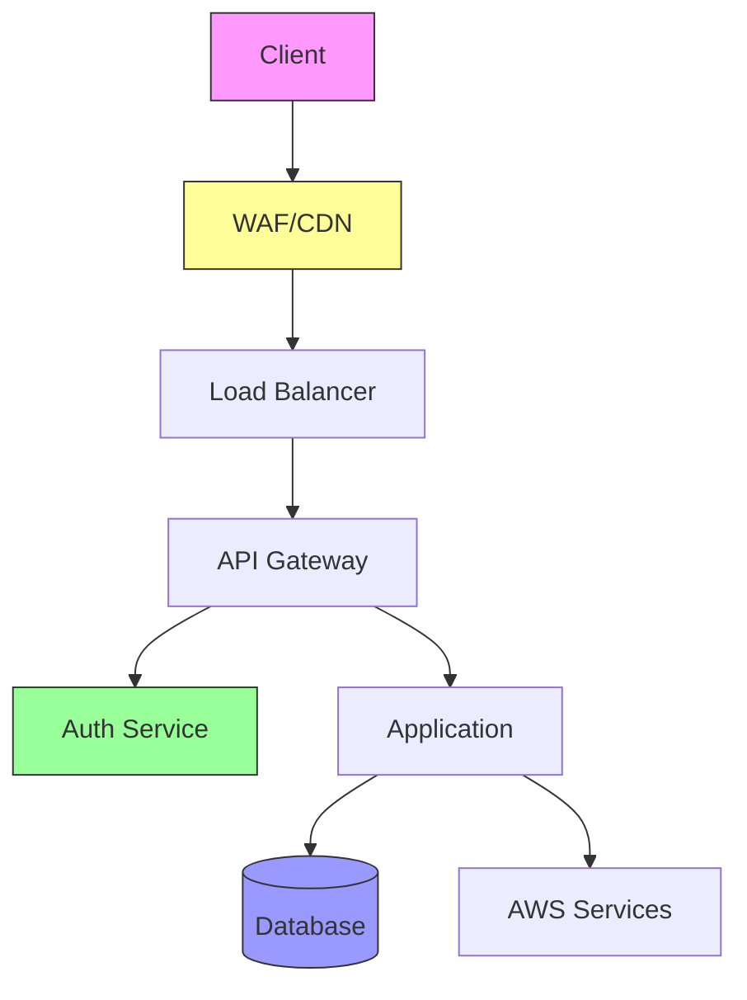

# Backend Security Guide 🔒

## Overview 🌐

This guide covers security best practices and implementations for the AWS Orchestrator backend.

## Security Architecture 🏗️



## Authentication 🔑

### 1. JWT Implementation
```python
from jose import jwt
from datetime import datetime, timedelta

class JWTHandler:
    def __init__(self, secret_key: str, algorithm: str = "HS256"):
        self.secret_key = secret_key
        self.algorithm = algorithm
    
    def create_token(self, data: dict, expires_delta: timedelta = None):
        to_encode = data.copy()
        if expires_delta:
            expire = datetime.utcnow() + expires_delta
        else:
            expire = datetime.utcnow() + timedelta(minutes=15)
        to_encode.update({"exp": expire})
        return jwt.encode(to_encode, self.secret_key, algorithm=self.algorithm)
    
    def verify_token(self, token: str):
        try:
            payload = jwt.decode(token, self.secret_key, algorithms=[self.algorithm])
            return payload
        except jwt.JWTError:
            return None
```

### 2. OAuth2 Integration
```python
from fastapi.security import OAuth2PasswordBearer
from fastapi import Depends, HTTPException, status

oauth2_scheme = OAuth2PasswordBearer(tokenUrl="token")

async def get_current_user(token: str = Depends(oauth2_scheme)):
    credentials_exception = HTTPException(
        status_code=status.HTTP_401_UNAUTHORIZED,
        detail="Could not validate credentials",
        headers={"WWW-Authenticate": "Bearer"},
    )
    
    try:
        payload = jwt_handler.verify_token(token)
        if payload is None:
            raise credentials_exception
        return payload
    except:
        raise credentials_exception
```

## Authorization 🛡️

### 1. Role-Based Access Control (RBAC)
```python
from enum import Enum
from typing import List

class Role(Enum):
    ADMIN = "admin"
    OPERATOR = "operator"
    VIEWER = "viewer"

class Permission(Enum):
    CREATE = "create"
    READ = "read"
    UPDATE = "update"
    DELETE = "delete"

ROLE_PERMISSIONS = {
    Role.ADMIN: [Permission.CREATE, Permission.READ, Permission.UPDATE, Permission.DELETE],
    Role.OPERATOR: [Permission.CREATE, Permission.READ, Permission.UPDATE],
    Role.VIEWER: [Permission.READ]
}

def check_permission(user_role: Role, required_permission: Permission):
    return required_permission in ROLE_PERMISSIONS[user_role]
```

### 2. Resource-Based Access Control
```python
class ResourcePolicy:
    def __init__(self, resource_type: str, resource_id: str):
        self.resource_type = resource_type
        self.resource_id = resource_id
    
    async def check_access(self, user_id: str, action: str):
        policy = await self.get_resource_policy()
        return self.evaluate_policy(policy, user_id, action)
    
    async def get_resource_policy(self):
        return await db.get_policy(self.resource_type, self.resource_id)
```

## Input Validation 🔍

### 1. Request Validation
```python
from pydantic import BaseModel, validator
from typing import Optional

class ResourceRequest(BaseModel):
    name: str
    type: str
    region: str
    tags: Optional[dict] = {}
    
    @validator('name')
    def name_must_be_valid(cls, v):
        if not v.isalnum():
            raise ValueError('name must be alphanumeric')
        return v
    
    @validator('type')
    def type_must_be_supported(cls, v):
        supported_types = ['ec2', 's3', 'rds']
        if v not in supported_types:
            raise ValueError(f'type must be one of {supported_types}')
        return v
```

### 2. SQL Injection Prevention
```python
from sqlalchemy import text
from typing import List

async def safe_query(query: str, params: dict):
    """Execute parameterized query safely"""
    return await db.execute(text(query), params)

async def get_resources(user_id: str, resource_types: List[str]):
    query = """
        SELECT * FROM resources 
        WHERE user_id = :user_id 
        AND type = ANY(:types)
    """
    return await safe_query(query, {
        "user_id": user_id,
        "types": resource_types
    })
```

## Encryption 🔐

### 1. Data Encryption
```python
from cryptography.fernet import Fernet
from base64 import b64encode

class Encryptor:
    def __init__(self, key: bytes):
        self.fernet = Fernet(key)
    
    def encrypt(self, data: str) -> str:
        return b64encode(
            self.fernet.encrypt(data.encode())
        ).decode()
    
    def decrypt(self, encrypted_data: str) -> str:
        return self.fernet.decrypt(
            encrypted_data.encode()
        ).decode()
```

### 2. Secret Management
```python
from aws_secretsmanager import SecretsManager

class SecretManager:
    def __init__(self):
        self.client = SecretsManager()
    
    async def get_secret(self, secret_name: str):
        try:
            response = await self.client.get_secret_value(
                SecretId=secret_name
            )
            return response['SecretString']
        except Exception as e:
            logger.error(f"Error retrieving secret: {e}")
            raise
```

## Rate Limiting 🚦

### 1. API Rate Limiting
```python
from fastapi import Request
from fastapi.responses import JSONResponse
import time
import redis

class RateLimiter:
    def __init__(self, redis_client: redis.Redis):
        self.redis = redis_client
        self.rate_limit = 100  # requests per minute
        
    async def check_rate_limit(self, request: Request):
        client_ip = request.client.host
        current = int(time.time())
        key = f"rate_limit:{client_ip}:{current//60}"
        
        requests = await self.redis.incr(key)
        await self.redis.expire(key, 60)
        
        if requests > self.rate_limit:
            return JSONResponse(
                status_code=429,
                content={"error": "Too many requests"}
            )
```

### 2. Resource Rate Limiting
```python
class ResourceRateLimiter:
    def __init__(self, redis_client: redis.Redis):
        self.redis = redis_client
        self.limits = {
            "ec2": 10,  # instances per hour
            "s3": 100,  # buckets per account
            "rds": 5    # databases per hour
        }
    
    async def check_resource_limit(self, user_id: str, resource_type: str):
        key = f"resource_limit:{user_id}:{resource_type}"
        count = await self.redis.get(key) or 0
        
        if int(count) >= self.limits[resource_type]:
            raise Exception("Resource limit exceeded")
```

## Security Headers 🏷️

### 1. Header Configuration
```python
from fastapi import FastAPI
from starlette.middleware.base import BaseHTTPMiddleware

class SecurityHeadersMiddleware(BaseHTTPMiddleware):
    async def dispatch(self, request, call_next):
        response = await call_next(request)
        response.headers["X-Content-Type-Options"] = "nosniff"
        response.headers["X-Frame-Options"] = "DENY"
        response.headers["X-XSS-Protection"] = "1; mode=block"
        response.headers["Strict-Transport-Security"] = "max-age=31536000; includeSubDomains"
        return response
```

### 2. CORS Configuration
```python
from fastapi.middleware.cors import CORSMiddleware

app.add_middleware(
    CORSMiddleware,
    allow_origins=["https://app.example.com"],
    allow_credentials=True,
    allow_methods=["*"],
    allow_headers=["*"],
    max_age=3600
)
```

## Best Practices 📚

1. **Authentication & Authorization**
   - Use strong password policies
   - Implement MFA
   - Regular token rotation
   - Principle of least privilege

2. **Data Security**
   - Encrypt sensitive data
   - Secure key management
   - Regular security audits
   - Data backup and recovery

3. **API Security**
   - Input validation
   - Rate limiting
   - Security headers
   - Error handling

4. **Infrastructure Security**
   - Network segmentation
   - Firewall rules
   - Regular updates
   - Security monitoring
