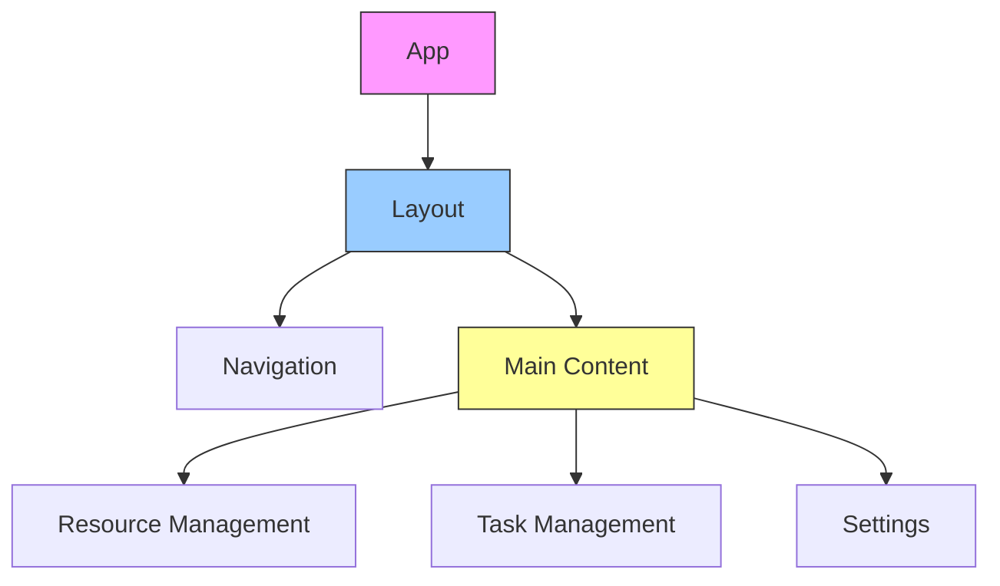

# Frontend Components Guide 🎨

## Overview 🌐

This guide covers the component architecture and implementation details for the AWS Orchestrator frontend.

## Component Architecture 🏗️



## Core Components 🧩

### 1. Layout Component
```typescript
// components/Layout/Layout.tsx
import React from 'react';
import { Navigation, MainContent } from '@/components';
import { useTheme } from '@/hooks';

interface LayoutProps {
  children: React.ReactNode;
}

export const Layout: React.FC<LayoutProps> = ({ children }) => {
  const { theme } = useTheme();
  
  return (
    <div className={`layout ${theme}`}>
      <Navigation />
      <main className="main-content">
        {children}
      </main>
    </div>
  );
};
```

### 2. Navigation Component
```typescript
// components/Navigation/Navigation.tsx
import React from 'react';
import { Link, useLocation } from 'react-router-dom';
import { Icon } from '@/components/common';

interface NavItem {
  path: string;
  label: string;
  icon: string;
}

const navItems: NavItem[] = [
  { path: '/resources', label: 'Resources', icon: 'cube' },
  { path: '/tasks', label: 'Tasks', icon: 'list' },
  { path: '/settings', label: 'Settings', icon: 'gear' }
];

export const Navigation: React.FC = () => {
  const location = useLocation();
  
  return (
    <nav className="navigation">
      {navItems.map(item => (
        <Link
          key={item.path}
          to={item.path}
          className={location.pathname === item.path ? 'active' : ''}
        >
          <Icon name={item.icon} />
          <span>{item.label}</span>
        </Link>
      ))}
    </nav>
  );
};
```

## Resource Components 📦

### 1. Resource List
```typescript
// components/Resources/ResourceList.tsx
import React from 'react';
import { useResourceQuery } from '@/hooks';
import { ResourceCard } from './ResourceCard';

interface Resource {
  id: string;
  type: string;
  name: string;
  status: string;
}

export const ResourceList: React.FC = () => {
  const { data: resources, isLoading, error } = useResourceQuery();
  
  if (isLoading) return <Spinner />;
  if (error) return <ErrorMessage error={error} />;
  
  return (
    <div className="resource-grid">
      {resources.map(resource => (
        <ResourceCard
          key={resource.id}
          resource={resource}
        />
      ))}
    </div>
  );
};
```

### 2. Resource Card
```typescript
// components/Resources/ResourceCard.tsx
import React from 'react';
import { Badge, Button } from '@/components/common';
import { useResourceActions } from '@/hooks';

interface ResourceCardProps {
  resource: Resource;
}

export const ResourceCard: React.FC<ResourceCardProps> = ({ resource }) => {
  const { startResource, stopResource, deleteResource } = useResourceActions();
  
  return (
    <div className="resource-card">
      <div className="resource-header">
        <h3>{resource.name}</h3>
        <Badge status={resource.status} />
      </div>
      <div className="resource-actions">
        <Button
          onClick={() => startResource(resource.id)}
          disabled={resource.status === 'running'}
        >
          Start
        </Button>
        <Button
          onClick={() => stopResource(resource.id)}
          disabled={resource.status === 'stopped'}
        >
          Stop
        </Button>
        <Button
          variant="danger"
          onClick={() => deleteResource(resource.id)}
        >
          Delete
        </Button>
      </div>
    </div>
  );
};
```

## Task Components 📋

### 1. Task Manager
```typescript
// components/Tasks/TaskManager.tsx
import React from 'react';
import { useTaskQueue } from '@/hooks';
import { TaskList } from './TaskList';
import { TaskFilters } from './TaskFilters';

export const TaskManager: React.FC = () => {
  const {
    tasks,
    filters,
    updateFilters,
    isLoading
  } = useTaskQueue();
  
  return (
    <div className="task-manager">
      <TaskFilters
        filters={filters}
        onFilterChange={updateFilters}
      />
      <TaskList
        tasks={tasks}
        isLoading={isLoading}
      />
    </div>
  );
};
```

### 2. Task Item
```typescript
// components/Tasks/TaskItem.tsx
import React from 'react';
import { Progress, TimeAgo } from '@/components/common';

interface TaskItemProps {
  task: Task;
  onCancel: (id: string) => void;
}

export const TaskItem: React.FC<TaskItemProps> = ({ task, onCancel }) => {
  return (
    <div className="task-item">
      <div className="task-info">
        <h4>{task.name}</h4>
        <span className="task-meta">
          Started <TimeAgo date={task.startTime} />
        </span>
      </div>
      <Progress
        value={task.progress}
        status={task.status}
      />
      {task.status === 'running' && (
        <Button
          size="small"
          onClick={() => onCancel(task.id)}
        >
          Cancel
        </Button>
      )}
    </div>
  );
};
```

## Form Components 📝

### 1. Resource Form
```typescript
// components/Forms/ResourceForm.tsx
import React from 'react';
import { useForm } from 'react-hook-form';
import { Input, Select, Button } from '@/components/common';

interface ResourceFormProps {
  onSubmit: (data: ResourceFormData) => void;
  initialData?: ResourceFormData;
}

export const ResourceForm: React.FC<ResourceFormProps> = ({
  onSubmit,
  initialData
}) => {
  const { register, handleSubmit, errors } = useForm({
    defaultValues: initialData
  });
  
  return (
    <form onSubmit={handleSubmit(onSubmit)}>
      <Input
        label="Resource Name"
        {...register('name', { required: true })}
        error={errors.name}
      />
      <Select
        label="Resource Type"
        options={resourceTypes}
        {...register('type', { required: true })}
        error={errors.type}
      />
      <Button type="submit">
        {initialData ? 'Update' : 'Create'} Resource
      </Button>
    </form>
  );
};
```

### 2. Settings Form
```typescript
// components/Forms/SettingsForm.tsx
import React from 'react';
import { useForm } from 'react-hook-form';
import { Input, Switch } from '@/components/common';

export const SettingsForm: React.FC = () => {
  const { register, handleSubmit } = useForm({
    defaultValues: useSettings()
  });
  
  return (
    <form onSubmit={handleSubmit(onSubmit)}>
      <Input
        label="AWS Region"
        {...register('region')}
      />
      <Switch
        label="Dark Mode"
        {...register('darkMode')}
      />
      <Switch
        label="Notifications"
        {...register('notifications')}
      />
      <Button type="submit">
        Save Settings
      </Button>
    </form>
  );
};
```

## Common Components 🔧

### 1. Button Component
```typescript
// components/common/Button.tsx
import React from 'react';
import classNames from 'classnames';

interface ButtonProps extends React.ButtonHTMLAttributes<HTMLButtonElement> {
  variant?: 'primary' | 'secondary' | 'danger';
  size?: 'small' | 'medium' | 'large';
  isLoading?: boolean;
}

export const Button: React.FC<ButtonProps> = ({
  children,
  variant = 'primary',
  size = 'medium',
  isLoading,
  className,
  ...props
}) => {
  return (
    <button
      className={classNames(
        'button',
        `button--${variant}`,
        `button--${size}`,
        { 'button--loading': isLoading },
        className
      )}
      disabled={isLoading || props.disabled}
      {...props}
    >
      {isLoading ? <Spinner size="small" /> : children}
    </button>
  );
};
```

### 2. Modal Component
```typescript
// components/common/Modal.tsx
import React from 'react';
import { createPortal } from 'react-dom';
import { useEscapeKey } from '@/hooks';

interface ModalProps {
  isOpen: boolean;
  onClose: () => void;
  title: string;
  children: React.ReactNode;
}

export const Modal: React.FC<ModalProps> = ({
  isOpen,
  onClose,
  title,
  children
}) => {
  useEscapeKey(onClose);
  
  if (!isOpen) return null;
  
  return createPortal(
    <div className="modal-overlay">
      <div className="modal">
        <div className="modal-header">
          <h2>{title}</h2>
          <button
            className="modal-close"
            onClick={onClose}
          >
            ×
          </button>
        </div>
        <div className="modal-content">
          {children}
        </div>
      </div>
    </div>,
    document.body
  );
};
```

## Best Practices 📚

1. **Component Design**
   - Single responsibility
   - Reusable components
   - Proper prop types
   - Error boundaries

2. **Performance**
   - Memoization
   - Code splitting
   - Lazy loading
   - Virtual scrolling

3. **Accessibility**
   - ARIA labels
   - Keyboard navigation
   - Color contrast
   - Screen reader support

4. **Testing**
   - Unit tests
   - Integration tests
   - Snapshot tests
   - User interaction tests
