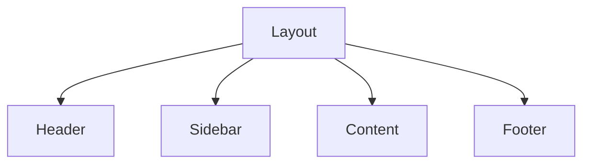
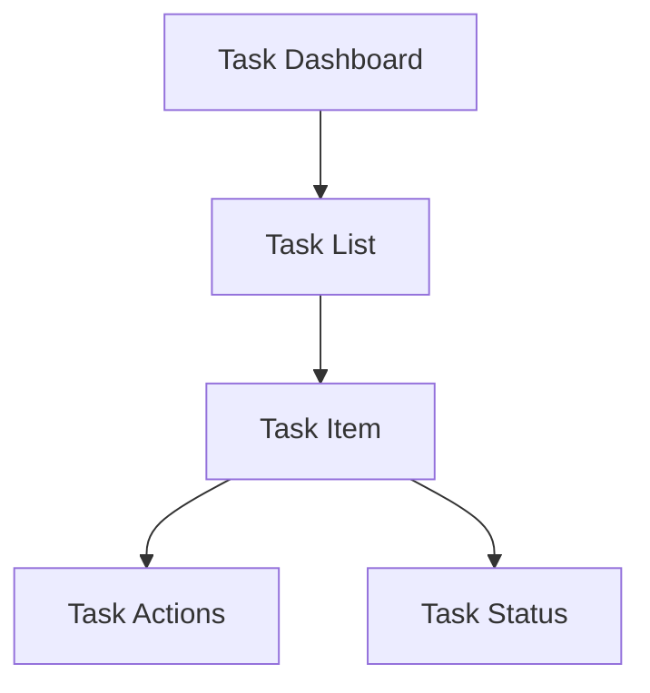
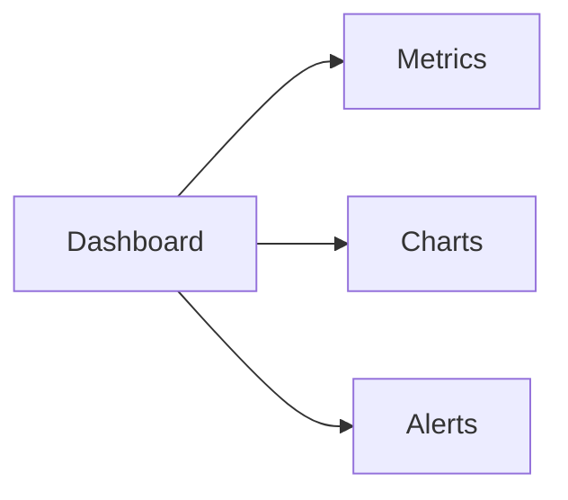

# Frontend Components 🎨

## Component Library Overview 📚

Our frontend uses a modular component architecture focusing on reusability and maintainability.

## Core Components 🧩

### 1. Layout Components



#### Usage Example
```jsx
import { Layout } from '@components/layout';

function App() {
  return (
    <Layout>
      <YourContent />
    </Layout>
  );
}
```

### 2. Task Management Components



#### Implementation
```jsx
const TaskItem = ({ task }) => (
  <div className="task-item">
    <TaskStatus status={task.status} />
    <TaskActions task={task} />
  </div>
);
```

### 3. Monitoring Components 📊



## Styling Guide 🎨

### 1. Theme Configuration
```javascript
export const theme = {
  colors: {
    primary: '#007AFF',
    secondary: '#5856D6',
    success: '#34C759',
    warning: '#FF9500',
    error: '#FF3B30'
  },
  spacing: {
    small: '8px',
    medium: '16px',
    large: '24px'
  }
}
```

### 2. Component Styling
```scss
.component {
  // Layout
  display: flex;
  flex-direction: column;
  
  // Spacing
  padding: var(--spacing-medium);
  margin: var(--spacing-small);
  
  // Colors
  background: var(--color-background);
  color: var(--color-text);
}
```

## State Management 🔄

### 1. Component State
```jsx
const [state, setState] = useState({
  loading: false,
  error: null,
  data: []
});
```

### 2. Redux Integration
```jsx
const mapStateToProps = (state) => ({
  tasks: state.tasks.items,
  loading: state.tasks.loading
});

export default connect(mapStateToProps)(TaskList);
```

## Performance Optimization ⚡

### 1. Lazy Loading
```jsx
const TaskEditor = lazy(() => 
  import('@components/TaskEditor')
);
```

### 2. Memoization
```jsx
const MemoizedComponent = memo(({ data }) => (
  <ExpensiveComponent data={data} />
));
```

## Accessibility ♿

### 1. ARIA Labels
```jsx
<button
  aria-label="Create new task"
  onClick={handleCreate}
>
  <PlusIcon />
</button>
```

### 2. Keyboard Navigation
```jsx
const handleKeyPress = (e) => {
  if (e.key === 'Enter') {
    handleAction();
  }
};
```

## Testing 🧪

### 1. Component Tests
```javascript
describe('TaskItem', () => {
  it('renders correctly', () => {
    const { getByText } = render(<TaskItem task={mockTask} />);
    expect(getByText(mockTask.title)).toBeInTheDocument();
  });
});
```

### 2. Integration Tests
```javascript
test('task creation flow', async () => {
  const { getByRole, findByText } = render(<TaskDashboard />);
  fireEvent.click(getByRole('button', { name: /create/i }));
  await findByText(/task created/i);
});
```

## Best Practices 📝

1. **Component Organization**
   - One component per file
   - Clear naming conventions
   - Proper directory structure

2. **Props Management**
   - Use PropTypes
   - Default props
   - Destructuring

3. **Error Handling**
   - Error boundaries
   - Fallback components
   - User feedback

4. **Performance**
   - Virtual scrolling
   - Image optimization
   - Code splitting
