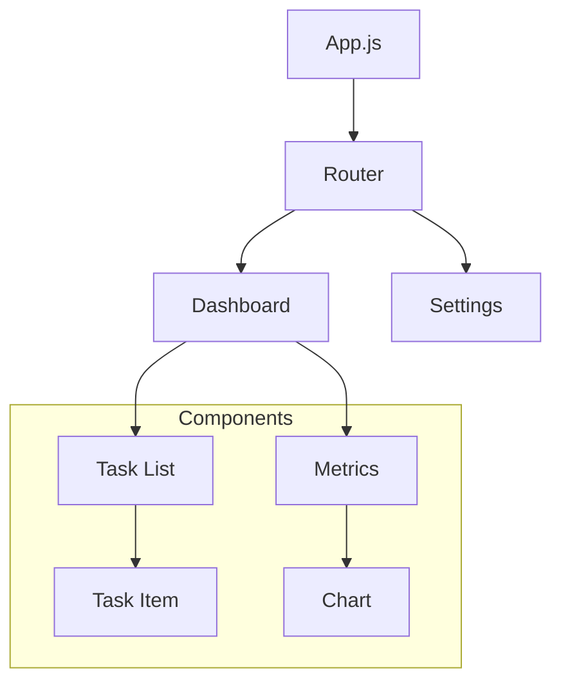
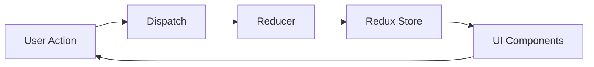

# Frontend Setup Guide 🚀

## Prerequisites 📋

- Node.js (v14.0.0 or higher)
- npm (v6.0.0 or higher)
- Git

## Installation Steps 📥

### 1. Clone Repository
```bash
git clone [repository-url]
cd aws-orchestrator/frontend
```

### 2. Install Dependencies
```bash
npm install
```

### 3. Configure Environment
```bash
cp .env.example .env
```

Edit `.env` with your settings:
```env
REACT_APP_API_URL=http://localhost:5000
REACT_APP_WS_URL=ws://localhost:5000
```

### 4. Start Development Server
```bash
npm start
```

## Project Structure 🏗️

```
frontend/
├── public/            # Static assets
├── src/
│   ├── components/   # Reusable UI components
│   ├── pages/       # Page components
│   ├── services/    # API services
│   ├── store/       # State management
│   ├── utils/       # Utility functions
│   └── App.js       # Root component
└── package.json     # Dependencies
```

## Available Scripts 🛠️

```bash
# Development
npm start           # Start dev server
npm test           # Run tests
npm run build      # Production build
npm run lint       # Run linter
npm run format     # Format code
```

## Component Architecture 📊



## State Management 🔄



## Testing Guide 🧪

### Unit Tests
```bash
# Run all tests
npm test

# Run with coverage
npm test -- --coverage
```

### E2E Tests
```bash
# Run Cypress tests
npm run cypress:open
```

## Best Practices ✨

### 1. Component Structure
- Use functional components
- Implement proper prop types
- Follow single responsibility
- Keep components small

### 2. State Management
- Use Redux for global state
- Local state for UI elements
- Implement selectors
- Optimize rerenders

### 3. Performance
- Lazy loading
- Code splitting
- Memoization
- Bundle optimization

## Troubleshooting 🔧

Common issues and solutions:

1. **Build Errors**
   ```bash
   # Clear cache
   npm clean-cache
   ```

2. **Dependencies Issues**
   ```bash
   # Reinstall dependencies
   rm -rf node_modules
   npm install
   ```

## Support 💬

- Check [Issues](https://github.com/your-repo/issues)
- Join our [Discord](https://discord.gg/your-server)
- Email: support@example.com
