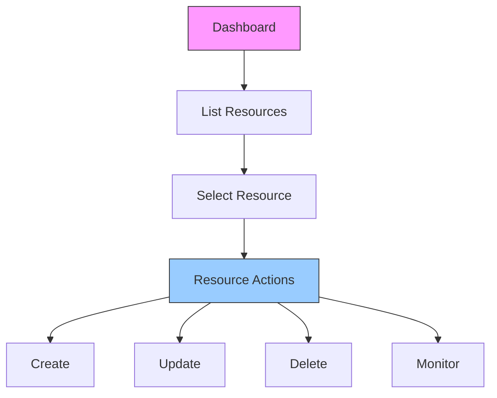
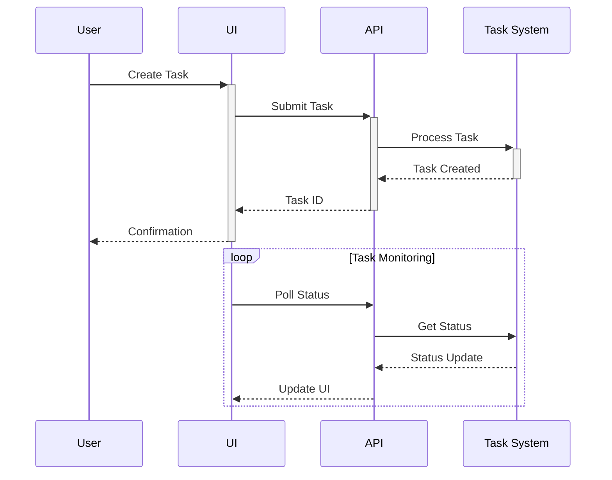
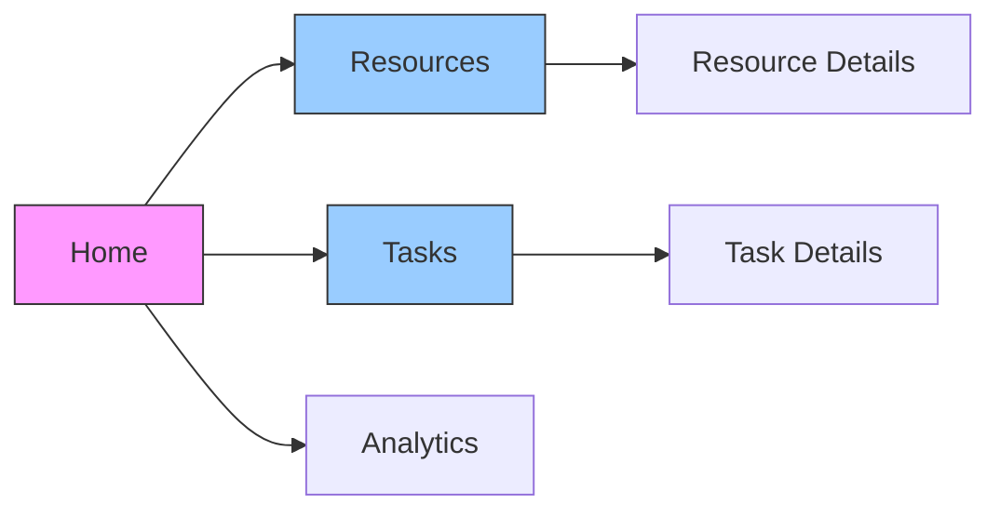
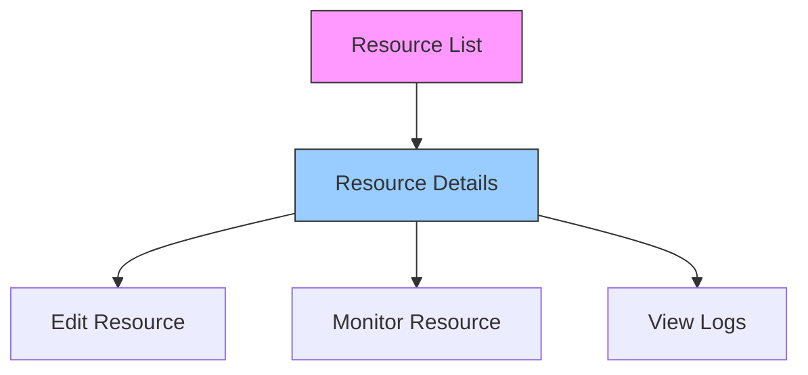
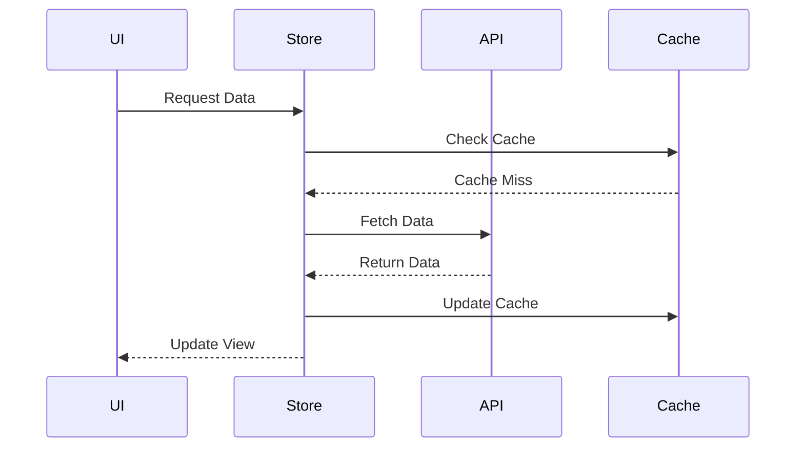
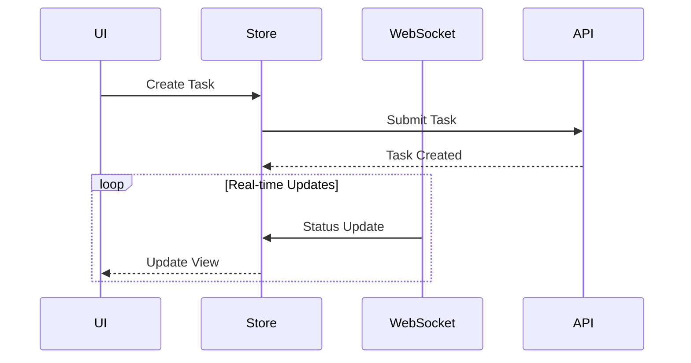

# Frontend Workflows 🔄

## Overview 🌐

This document outlines the key user workflows and interactions in the AWS Orchestrator frontend.

## User Workflows 🚶

### 1. Resource Management



### 2. Task Management



## Component Interactions 🔄

### 1. State Management
```typescript
interface AppState {
    resources: {
        items: Resource[];
        loading: boolean;
        error: Error | null;
    };
    tasks: {
        items: Task[];
        activeTask: Task | null;
        status: Record<string, TaskStatus>;
    };
    ui: {
        selectedResource: string | null;
        activeView: string;
        notifications: Notification[];
    };
}
```

### 2. Event Handling
```typescript
class WorkflowManager {
    async handleResourceAction(action: ResourceAction) {
        try {
            await this.startAction(action);
            await this.monitorProgress(action.id);
            await this.completeAction(action);
        } catch (error) {
            await this.handleError(error);
        }
    }
}
```

## User Interface States 🎨

### 1. Loading States
```typescript
interface LoadingState {
    isLoading: boolean;
    progress: number;
    message: string;
}

class LoadingManager {
    showLoading(message: string) {
        this.setState({
            isLoading: true,
            message,
            progress: 0
        });
    }
    
    updateProgress(progress: number) {
        this.setState({ progress });
    }
}
```

### 2. Error States
```typescript
interface ErrorState {
    hasError: boolean;
    message: string;
    retry?: () => Promise<void>;
}

class ErrorHandler {
    handleError(error: Error) {
        this.setState({
            hasError: true,
            message: error.message,
            retry: this.retryOperation
        });
    }
}
```

## Form Handling 📝

### 1. Resource Creation Form
```typescript
interface ResourceForm {
    validate(): boolean;
    handleSubmit(data: FormData): Promise<void>;
    handleCancel(): void;
}

class ResourceFormManager implements ResourceForm {
    async handleSubmit(data: FormData) {
        if (this.validate()) {
            await this.createResource(data);
            this.showSuccess();
        }
    }
}
```

### 2. Task Configuration Form
```typescript
interface TaskForm {
    taskType: string;
    parameters: Record<string, any>;
    validation: Record<string, (value: any) => boolean>;
}

class TaskFormHandler {
    validateField(field: string, value: any): boolean {
        return this.validation[field]?.(value) ?? true;
    }
    
    async submitTask(data: TaskForm) {
        if (this.validateAll(data)) {
            return await this.taskService.create(data);
        }
    }
}
```

## Navigation Flows 🧭

### 1. Main Navigation


### 2. Resource Navigation


## Data Flow 📊

### 1. Resource Data Flow


### 2. Task Data Flow


## Error Handling 🚨

### 1. Network Errors
```typescript
class NetworkErrorHandler {
    async handleNetworkError(error: NetworkError) {
        if (error.isRetryable) {
            return await this.retryWithBackoff(error);
        }
        
        this.showErrorNotification({
            message: 'Network error occurred',
            action: this.getRetryAction(error)
        });
    }
}
```

### 2. Validation Errors
```typescript
class ValidationHandler {
    handleValidationError(error: ValidationError) {
        this.setState({
            errors: error.fields,
            message: error.message
        });
        
        this.scrollToError();
        this.highlightErrorFields();
    }
}
```

## Performance Optimization ⚡

### 1. Data Caching
```typescript
class DataCache {
    private cache: Map<string, CacheEntry>;
    
    async getData(key: string): Promise<Data> {
        if (this.hasValidCache(key)) {
            return this.cache.get(key).data;
        }
        
        const data = await this.fetchData(key);
        this.cache.set(key, {
            data,
            timestamp: Date.now()
        });
        
        return data;
    }
}
```

### 2. Component Optimization
```typescript
const MemoizedComponent = memo(({ data }) => {
    const processedData = useMemo(() => {
        return expensiveProcess(data);
    }, [data]);
    
    return <Component data={processedData} />;
});
```

## Best Practices 📚

1. **State Management**
   - Single source of truth
   - Immutable updates
   - Optimistic updates
   - Error recovery

2. **Performance**
   - Component memoization
   - Virtual scrolling
   - Lazy loading
   - Data caching

3. **User Experience**
   - Loading states
   - Error feedback
   - Progress indicators
   - Responsive design

4. **Code Organization**
   - Feature modules
   - Shared components
   - Type safety
   - Documentation
