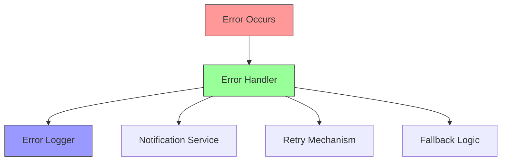

# Error Handling & Troubleshooting Guide 🔧

## Overview 🌐

This guide covers error handling strategies, common issues, and troubleshooting procedures for the AWS Orchestrator platform.

## Error Handling Architecture 🏗️



## Error Categories 📋

### 1. API Errors
```typescript
// types/errors.ts
enum ErrorType {
  VALIDATION = 'VALIDATION_ERROR',
  AUTHENTICATION = 'AUTH_ERROR',
  AUTHORIZATION = 'ACCESS_DENIED',
  RESOURCE = 'RESOURCE_ERROR',
  AWS = 'AWS_ERROR',
  NETWORK = 'NETWORK_ERROR',
  UNKNOWN = 'UNKNOWN_ERROR'
}

interface AppError {
  type: ErrorType;
  code: string;
  message: string;
  details?: any;
  timestamp: Date;
}
```

### 2. Common Error Codes
```typescript
// constants/errors.ts
const ERROR_CODES = {
  // Authentication Errors
  AUTH_001: 'Invalid credentials',
  AUTH_002: 'Token expired',
  AUTH_003: 'Invalid token',
  
  // Resource Errors
  RES_001: 'Resource not found',
  RES_002: 'Resource limit exceeded',
  RES_003: 'Invalid resource configuration',
  
  // AWS Errors
  AWS_001: 'AWS API error',
  AWS_002: 'Rate limit exceeded',
  AWS_003: 'Invalid AWS credentials'
};
```

## Error Handling Implementation 🛠️

### 1. Global Error Handler
```typescript
// middleware/errorHandler.ts
import { ErrorLogger } from '../services/logger';
import { NotificationService } from '../services/notification';

export class GlobalErrorHandler {
  private logger: ErrorLogger;
  private notifier: NotificationService;

  constructor() {
    this.logger = new ErrorLogger();
    this.notifier = new NotificationService();
  }

  async handleError(error: AppError): Promise<void> {
    // Log error
    await this.logger.logError(error);

    // Notify if critical
    if (this.isCriticalError(error)) {
      await this.notifier.sendAlert({
        level: 'critical',
        error: error
      });
    }

    // Return appropriate response
    return this.formatErrorResponse(error);
  }

  private isCriticalError(error: AppError): boolean {
    return [
      ErrorType.AUTHENTICATION,
      ErrorType.AWS
    ].includes(error.type);
  }

  private formatErrorResponse(error: AppError) {
    return {
      status: this.getStatusCode(error.type),
      body: {
        code: error.code,
        message: error.message,
        timestamp: error.timestamp
      }
    };
  }
}
```

### 2. Retry Mechanism
```typescript
// utils/retry.ts
interface RetryConfig {
  maxAttempts: number;
  baseDelay: number;
  maxDelay: number;
}

export async function withRetry<T>(
  operation: () => Promise<T>,
  config: RetryConfig
): Promise<T> {
  let lastError: Error;
  
  for (let attempt = 1; attempt <= config.maxAttempts; attempt++) {
    try {
      return await operation();
    } catch (error) {
      lastError = error;
      
      if (!isRetryableError(error) || attempt === config.maxAttempts) {
        throw error;
      }
      
      const delay = calculateDelay(attempt, config);
      await sleep(delay);
    }
  }
  
  throw lastError;
}
```

## Common Issues & Solutions 🎯

### 1. Authentication Issues
```typescript
// troubleshooting/auth.ts
export const authTroubleshooting = {
  TOKEN_EXPIRED: {
    symptoms: [
      '401 Unauthorized response',
      'Token expired message'
    ],
    solutions: [
      'Refresh the access token',
      'Check token expiration time',
      'Verify token refresh mechanism'
    ],
    code: `
    // Check token expiration
    const isTokenExpired = (token: string): boolean => {
      const decoded = jwt.decode(token);
      return decoded.exp < Date.now() / 1000;
    };
    `
  }
};
```

### 2. Resource Issues
```typescript
// troubleshooting/resources.ts
export const resourceTroubleshooting = {
  LIMIT_EXCEEDED: {
    symptoms: [
      'Resource creation fails',
      'Limit exceeded message'
    ],
    solutions: [
      'Check AWS service quotas',
      'Review resource allocation',
      'Implement resource cleanup'
    ],
    code: `
    // Check resource limits
    async function checkResourceLimits(
      resourceType: string,
      region: string
    ): Promise<boolean> {
      const limits = await getServiceQuotas(resourceType, region);
      const usage = await getCurrentUsage(resourceType, region);
      return usage < limits;
    }
    `
  }
};
```

## Debugging Tools 🔍

### 1. Logger Configuration
```typescript
// utils/logger.ts
import winston from 'winston';

export const logger = winston.createLogger({
  level: 'debug',
  format: winston.format.combine(
    winston.format.timestamp(),
    winston.format.json()
  ),
  transports: [
    new winston.transports.File({
      filename: 'error.log',
      level: 'error'
    }),
    new winston.transports.File({
      filename: 'combined.log'
    })
  ]
});
```

### 2. Debug Middleware
```typescript
// middleware/debug.ts
export const debugMiddleware = (req, res, next) => {
  if (process.env.DEBUG_MODE === 'true') {
    console.log({
      timestamp: new Date().toISOString(),
      method: req.method,
      url: req.url,
      headers: req.headers,
      body: req.body,
      query: req.query
    });
  }
  next();
};
```

## Monitoring & Alerts 📊

### 1. Health Checks
```typescript
// monitoring/health.ts
export class HealthChecker {
  async checkSystem(): Promise<HealthStatus> {
    return {
      api: await this.checkAPI(),
      database: await this.checkDatabase(),
      aws: await this.checkAWSConnection(),
      cache: await this.checkCache()
    };
  }

  private async checkAPI(): Promise<ComponentStatus> {
    try {
      const response = await fetch('/api/health');
      return {
        status: response.ok ? 'healthy' : 'unhealthy',
        latency: response.headers.get('x-response-time')
      };
    } catch (error) {
      return {
        status: 'unhealthy',
        error: error.message
      };
    }
  }
}
```

### 2. Alert Configuration
```typescript
// monitoring/alerts.ts
export const alertConfig = {
  errorRateThreshold: {
    critical: 0.05, // 5% error rate
    warning: 0.02   // 2% error rate
  },
  responseTimeThreshold: {
    critical: 2000, // 2 seconds
    warning: 1000   // 1 second
  },
  resourceUsageThreshold: {
    critical: 0.90, // 90% usage
    warning: 0.75   // 75% usage
  }
};
```

## Best Practices 📚

1. **Error Handling**
   - Use typed errors
   - Implement retry logic
   - Proper error logging
   - User-friendly messages

2. **Debugging**
   - Structured logging
   - Request tracing
   - Performance monitoring
   - Debug mode toggle

3. **Monitoring**
   - Health checks
   - Performance metrics
   - Resource monitoring
   - Alert thresholds

4. **Documentation**
   - Error codes
   - Troubleshooting guides
   - Common solutions
   - Debug procedures
